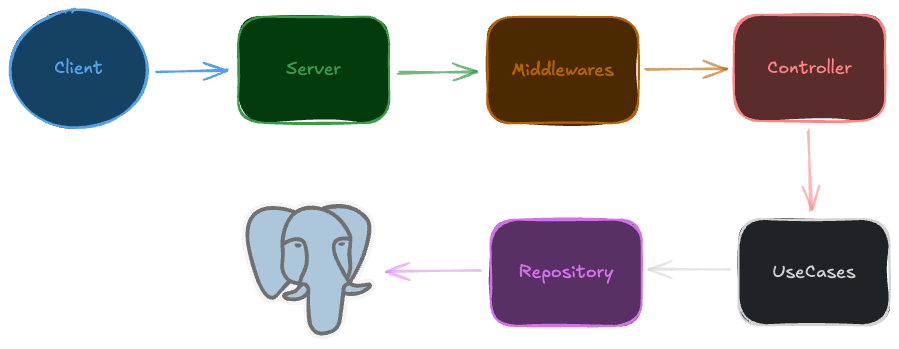

# jwt-nodejs

|        Server Structure        |
| :----------------------------: |
|  |

This is an API built with Node.js, Express, Docker, Prisma, and PostgreSQL, following some clean architecture and SOLID principles. It implements an authentication flow using JWT Tokens. The project employs design patterns like dependency inversion and factory patterns to ensure scalability and maintainability.

## Installation

> [!IMPORTANT]
> To setup and run the **client**, ensure you have `Node.js (20.16.0 or higher)` installed.
>
> Remember to change the provided example variables to actual values ​​in the `.env` file.

### Clone the repository

```sh
git clone git@github.com:d0ugui/jwt-nodejs
cd jwt-nodejs
```

#### Create .env file

```sh
cp .env.example .env
```

#### Create and start the containers

```sh
docker compose up -d
```

#### Run database migrations

```sh
pnpm prisma migrate dev
```

#### Start the server

```sh
pnpm dev
```
